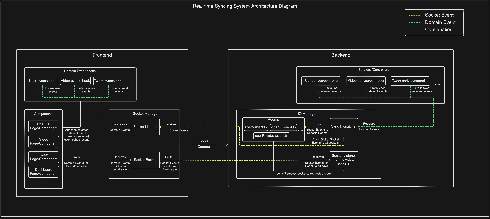

# Real-Time Syncing System Documentation

- ### Enables **real-time synchronization** of data between frontend components and backend services.
- ### It uses a **domain-event-driven** architecture combined with **Socket.IO** for efficient event propagation.
- ### Uses **Socket.IO Rooms** for event targeting, ensuring only required events are emitted to the client based on his current UI Context.

## Architecture Diagram

## Core Components/Concepts

### 1. Domain Events: 
- #### Represent high-level changes in business entities (User, Video, Tweet,etc).
- #### Originates from backend services or frontend actions.
- #### Decoupled from transport (they are abstract events, not sockets).
- #### Categorised for loosely coupled independent entities which can occur independently in UI context(like user, video, tweet) while tightly coupled entites will be categorised by their parent entity(like comment,reply will be categorised as video event).

### 2. Domain Event Hooks:
- #### Subscribes to domain events.
- #### Accepts callbacks from component to update UI.
- #### Emits Room Join/Leave domain event based on the event category.

### 3. Socket Manager:
- #### Manages a persistent Socket.IO connection.
- #### Has 2 components:
    - #### Socket Listener: receives socket events -> rebroadcasts them as domain events.
    - #### Socket Emitter: listens domain events -> emits them as socket events to backend, e.g., room join/leave.

### 4. Services/Controllers: Emit domain events when data(which needs to be synced) changes occur. 

### 5. IO Manager:
- #### Maintains socket connections.
- #### Manages 2 types of rooms (for event targeting):
    - #### Public Scoped Event rooms: rooms where events should be emitted to all sockets of the room. Eg: `user:<id>`, `video:<id>`.
    - #### Private Event room: rooms where events should be emitted to all sockets of an individual user. Eg: `userPrivate:<id>`.
- #### Listens for join/leave events and assigns/removes sockets to rooms.
- #### Has 2 components: 
    - #### Sync Dispatcher: Receives domain events from services -> Dispatches them to the correct room(s) determined by their event category or globally via Socket.IO (in case of global events).
    - #### Socket Listener (per-socket): Handles individual socket lifecycle (connect/disconnect, room management).

## Event Flow
### 1. From Backend to Frontend:
- #### Service/Controller emits domain event -> `Sync Dispatcher`.
- #### `Sync Dispatcher` broadcasts socket event -> correct socket room(s).
- #### `Socket Manager` (frontend) receives socket events -> re-broadcasts as domain events.
- #### Domain Event hooks subscribes to domain events
- #### Components attaches required domain event hooks & passes callbacks to update its UI.

### 2. From Frontend to Backend:
- #### Component emits domain event (for room join/leave) via Domain Event hook.
- #### `Socket Manager` converts it into socket event -> backend
- #### `IO Manager` receives socket event via `Socket Listener` → adds/removes socket from requested room.

## Key Design Principles
- ### Decoupled: UI logic stays local; sync logic stays centralized.
- ### Scalable: New event categories just require new domain event hooks + backend service event emitters.
- ### Clean lifecycle: Components attach listeners on mount and detach on unmount.
- ### Room-based efficiency: Only relevant users receive relevant events related to their current UI.